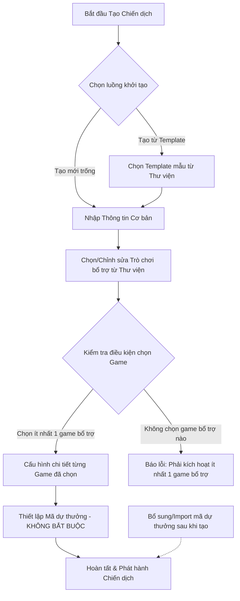

# TÀI LIỆU ĐẶC TẢ YÊU CẦU NGHIỆP VỤ (PRODUCT REQUIREMENT DOCUMENT - PRD)
## DỰ ÁN: HỆ THỐNG GAMIFICATION SAAS PLATFORM

---

### THÔNG TIN TÀI LIỆU
*   **Dự án:** Gamification SaaS (Software-as-a-Service) Platform
*   **Phiên bản:** v1.1 (Cập nhật theo phản hồi khách hàng)
*   **Tác giả:** Chuyên gia Business Analyst (Senior BA)
*   **Trạng thái:** Tài liệu Đặc tả Hoàn chỉnh (Approved Specifications)
*   **Ngày cập nhật:** 09/06/2026

---

## 1. TỔNG QUAN DỰ ÁN (PROJECT OVERVIEW)

### 1.1. Bối cảnh & Mục tiêu
Hệ thống **Gamification SaaS** là một nền tảng cung cấp dịch vụ trò chơi hóa dưới dạng dịch vụ phần mềm (SaaS). Nền tảng này cho phép các doanh nghiệp (Merchants/Clients) tự tạo, cấu hình và vận hành các chiến dịch marketing tương tác (Interactive Marketing Campaigns) nhằm thu hút khách hàng, tích lũy điểm thưởng, quay số và đổi quà. 

Mục tiêu của tài liệu này là đặc tả chi tiết luồng nghiệp vụ, giao diện, tính năng và các ràng buộc kỹ thuật của hệ thống để đội ngũ thiết kế UI/UX, lập trình viên (Developer) và kiểm thử viên (Tester) có thể hiện thực hóa sản phẩm một cách đồng nhất và chính xác.

### 1.2. Kiến trúc Phân hệ Người dùng (Sub-systems)
Hệ thống bao gồm 3 cổng thông tin (Web Portals) độc lập được kết nối qua cơ sở dữ liệu dùng chung:
1.  **Trang Quản trị Hệ thống (Admin Portal):** Dành cho nhà vận hành SaaS (Platform Owner) quản lý doanh nghiệp, các gói cước dịch vụ, hạn mức thành viên/SMS và kiểm soát kho trò chơi mẫu.
2.  **Trang Doanh nghiệp (Business/Merchant Portal):** Dành cho các thương hiệu đăng ký sử dụng dịch vụ để thiết lập chiến dịch, cấu hình game, nạp quỹ SMS, quản lý mã dự thưởng, phê duyệt địa chỉ giao quà vật lý và xem báo cáo hiệu suất.
3.  **Trang Người chơi (User/Player Portal):** Thiết kế tối ưu Mobile-first cho người dùng cuối tham gia đăng ký xác thực bằng SMS OTP, đăng nhập bằng SĐT & Mật khẩu để nhập mã dự thưởng tích điểm, chơi game vòng quay và thực hiện điền thông tin địa chỉ giao nhận quà.

---

## 2. KIẾN TRÚC PHÂN QUYỀN & QUẢN TRỊ (ACTOR & AUTHORIZATION ARCHITECTURE)

| Phân hệ (Portal) | Đối tượng sử dụng (Actors) | Quyền hạn & Chức năng chính |
| :--- | :--- | :--- |
| **Admin Portal** | Super Admin, System Admin | - Quản lý danh mục doanh nghiệp. - Quản lý và thiết lập gói dịch vụ (Subscription Plans) gồm phí thuê bao và hạn mức thành viên. - Giám sát hạn mức tài nguyên hệ thống (lượng SMS, lượng code phát hành). - Quản trị và đăng ký các Game Plugin mẫu vào hệ thống. - Quản trị, tạo lập và cập nhật thư viện Template chiến dịch mẫu (Basic/Premium). |
| **Business Portal** | Business Owner, Campaign Manager | - Quản lý thông tin doanh nghiệp & cấu hình thương hiệu. - Theo dõi gói dịch vụ đang dùng, mua thêm gói SMS lẻ (giá 600đ/SMS). - Tạo lập chiến dịch, chọn áp dụng Template mẫu (theo phân quyền gói cước) và cấu hình các Game Plugin bổ trợ. - Quản lý danh sách mã dự thưởng (CSV/Auto-gen). - Tiếp nhận và cập nhật trạng thái vận đơn cho quà vật lý. - Theo dõi báo cáo thống kê chiến dịch. |
| **User Portal** | End User / Player | - **Đăng ký tài khoản:** Bắt buộc xác thực OTP qua SMS. - **Đăng nhập:** Sử dụng Số điện thoại & Mật khẩu. - Nhập mã dự thưởng tích lũy điểm theo từng chiến dịch (điểm hết hạn khi campaign kết thúc). - Tham gia các trò chơi bổ trợ đang kích hoạt. - Điền thông tin địa chỉ giao hàng nhận quà vật lý hoặc nhận mã voucher trực tiếp qua SMS. |

---

## 3. ĐẶC TẢ TÍNH NĂNG CHI TIẾT (DETAILED FUNCTIONAL SPECIFICATIONS)

### 3.1. Phân hệ Quản lý Doanh nghiệp & Gói Dịch Vụ (Admin Portal & Subscription Management)

Hệ thống SaaS áp dụng cơ chế định phí dịch vụ dựa trên số lượng thành viên (Người chơi tham gia chiến dịch) và số lượng tin nhắn SMS gửi ra để xác thực OTP hoặc thông báo trúng thưởng.

#### 3.1.1. Ma trận Gói dịch vụ SaaS (SaaS Subscription Matrix)

| Tên Gói (Plan) | Hạn mức Thành viên (Unique Players Limit) | Đơn giá thuê bao / Tháng | Hạn mức SMS miễn phí đi kèm |
| :--- | :--- | :--- | :--- |
| **Free** | Tối đa 50 người chơi | 0 USD | 50 SMS / tháng |
| **Growth** | Tối đa 10,000 người chơi | 79 USD | 10,000 SMS / tháng |
| **Pro** | Tối đa 50,000 người chơi | 299 USD | 50,000 SMS / tháng |
| **Enterprise** | Không giới hạn | Liên hệ (Custom Price) | Tùy biến theo hợp đồng |

*   **Quy tắc kiểm soát hạn mức:**
    *   **Hạn mức Thành viên (Unique Players):** Là số lượng tài khoản người chơi duy nhất đăng ký và tham gia vào các chiến dịch của doanh nghiệp đó. Khi số lượng người chơi đạt 100% hạn mức của gói hiện tại, hệ thống sẽ tự động khóa luồng đăng ký mới của người chơi đối với mọi chiến dịch của doanh nghiệp này và hiển thị thông báo yêu cầu nâng cấp gói dịch vụ đối với doanh nghiệp.
    *   **Hạn mức SMS:** SMS được tiêu thụ khi người chơi đăng ký (gửi OTP), lấy lại mật khẩu, hoặc khi trúng quà/đổi quà số (gửi mã Voucher). Khi số dư SMS về 0, hệ thống sẽ tạm dừng gửi tin nhắn SMS, doanh nghiệp cần thực hiện mua thêm SMS để tiếp tục vận hành.
*   **Cơ chế gia hạn & Thời gian ân hạn (Grace Period):**
    *   Khi gói dịch vụ hết hạn hoặc thanh toán gia hạn thất bại, hệ thống áp dụng **thời gian ân hạn (Grace Period) là 7 ngày**. 
    *   Trong thời gian ân hạn, các chiến dịch vẫn được phép chạy bình thường, nhưng hệ thống sẽ gửi tin nhắn cảnh báo yêu cầu gia hạn đến trang quản trị của Merchant. 
    *   Sau 7 ngày nếu không hoàn tất thanh toán, hệ thống sẽ tự động tạm khóa (Deactivate) toàn bộ chiến dịch đang hoạt động và tạm dừng truy cập User Portal của Merchant đó.

#### 3.1.2. Cơ chế mua thêm SMS & Tùy chọn SMS Gateway
*   **Mua thêm SMS lẻ:** Doanh nghiệp có thể chủ động nạp thêm quỹ SMS bất kỳ lúc nào thông qua cổng thanh toán tích hợp sẵn trên Business Portal.
    *   **Đơn giá:** **600 VND / SMS**.
    *   SMS mua thêm sẽ được cộng dồn vào quỹ số dư SMS của doanh nghiệp và **không bị hết hạn** theo tháng.
*   **Tích hợp SMS Gateway riêng (Bring Your Own Gateway):** 
    *   Mặc định, các gói **Free** và **Growth** bắt buộc sử dụng hạ tầng SMS Gateway và Brandname dùng chung của nền tảng (trả phí 600đ/SMS).
    *   Đối với các gói **Pro** và **Enterprise**, hệ thống hỗ trợ cấu hình tài khoản SMS Gateway riêng của doanh nghiệp (ví dụ: cấu hình API Key của eSMS, VietGuys, Twilio riêng của họ) để tự chịu chi phí và sử dụng Brandname độc lập.

---

### 3.2. Quản lý Chiến dịch & Cấu hình Trò chơi bổ trợ (Campaign & Game Configuration)

Hệ thống được thiết kế theo hướng **mở rộng và linh hoạt (Extensible Platform)**, cho phép dễ dàng tích hợp và mở rộng thêm nhiều thể loại trò chơi bổ trợ khác nhau trong tương lai mà không cần cấu trúc lại lõi phần mềm.

*   **Thư viện Template Chiến dịch mẫu (Campaign Template Library):**
    *   **Quyền tạo lập:** Chỉ **Admin hệ thống (System Admin)** mới được phép tạo lập, quản lý và cập nhật danh sách các Template mẫu trong thư viện dùng chung. Merchant không được tự tạo hay lưu Template riêng.
    *   **Cấu trúc một Template:** Gồm cấu hình đầy đủ bao gồm cả thiết kế giao diện mẫu (tông màu chủ đạo, logo mẫu, hình nền, banner) và cấu hình game bổ trợ mặc định (ví dụ: vòng quay may mắn được tạo sẵn 8 ô giải thưởng mẫu với luật điểm tương ứng).
    *   **Phân quyền sử dụng theo gói cước (Plan Restrictions):**
        *   *Basic Templates (Mẫu Cơ Bản):* Khả dụng cho mọi gói dịch vụ (kể cả gói Free).
        *   *Premium Templates (Mẫu Cao Cấp):* Chỉ mở khóa cho các Merchant đăng ký gói dịch vụ trả phí (Growth, Pro, Enterprise).
    *   **Quy trình áp dụng:** Khi tạo chiến dịch mới, Merchant chọn Template mong muốn từ thư viện. Hệ thống sẽ clone toàn bộ giao diện và game mặc định của Template đó vào chiến dịch mới. Merchant chỉ cần tùy chỉnh lại văn bản, hình ảnh cụ thể và điều chỉnh tỷ lệ trúng thưởng của game theo nhu cầu thực tế.

*   **Thư viện Trò chơi (Game Library Architecture):**
    *   Hệ thống sở hữu một danh mục trò chơi mẫu (Ví dụ hiện tại: Vòng quay may mắn, Đổi quà tích lũy; tương lai: Lật hình, Quay slot, Nuôi thú ảo...).
    *   Khi tạo chiến dịch, Business Portal hiển thị danh sách các trò chơi dưới dạng các khối tùy chọn (Game Cards) kèm nút Toggle ON/OFF.
*   **Quy định bắt buộc & Chỉnh sửa cấu hình:**
    1.  **Nhập mã dự thưởng (Không bắt buộc lúc khởi tạo):** Đây vẫn là tính năng cốt lõi để nạp điểm, nhưng doanh nghiệp không bắt buộc phải cấu hình hoặc import mã ngay tại thời điểm tạo chiến dịch. Doanh nghiệp có thể bỏ qua bước này và thực hiện cập nhật, import mã dự thưởng sau khi chiến dịch đã được khởi tạo thành công.
    2.  **Trò chơi bổ trợ (Ít nhất 1 game):** Doanh nghiệp bắt buộc phải bật ít nhất một trò chơi bổ trợ trong thư viện game để người chơi tiêu thụ điểm tích lũy. Nếu doanh nghiệp lưu chiến dịch mà chưa bật game bổ trợ nào, hệ thống sẽ hiển thị thông báo lỗi: *"Chiến dịch cần kích hoạt ít nhất 1 trò chơi bổ trợ để bắt đầu"*.
    3.  **Chỉnh sửa chiến dịch đang chạy (Active Modification):** Merchant được phép chỉnh sửa toàn bộ thông số chiến dịch và cấu hình game bất kỳ lúc nào, kể cả khi chiến dịch đang ở trạng thái hoạt động (Active). Cấu hình mới sẽ tự động được áp dụng ngay lập tức cho các lượt chơi tiếp theo mà không ảnh hưởng đến dữ liệu lịch sử tham gia trước đó của người chơi.
*   **Thuật toán trúng thưởng game "Vòng quay may mắn" (Lucky Wheel):**
    *   **Cơ chế kết hợp:** Cho phép Merchant cấu hình tỉ lệ % trúng thưởng cố định cho từng ô quà, đồng thời thiết lập giới hạn số lượng quà trúng tối đa (giới hạn theo ngày, theo tuần hoặc trên toàn chiến dịch) nhằm kiểm soát tốc độ phát quà và bảo vệ kho quà lớn.
    *   **Xử lý khi hết quà/chạm giới hạn:** Nếu người chơi quay trúng ô quà đã hết tồn kho hoặc đã đạt giới hạn tối đa trong ngày/tuần, hệ thống tự động chuyển đổi phần thưởng sang quà thay thế mặc định (ví dụ: cộng điểm hoặc thông báo chúc may mắn lần sau).

---

### 3.3. Module Nhập Mã Dự Thưởng & Quản lý Điểm (Rewards Code Entry & Points Management)

#### 3.3.1. Nghiệp vụ Quản lý Điểm và Hạn Dùng theo Chiến dịch
*   Mọi điểm số người chơi kiếm được từ việc nhập mã dự thưởng của một chiến dịch cụ thể chỉ có giá trị sử dụng trong phạm vi chiến dịch đó.
*   **Cơ chế hết hạn:** Khi chiến dịch chuyển sang trạng thái "Kết thúc" (Expired) dựa trên cấu hình thời gian kết thúc của doanh nghiệp, số dư điểm của toàn bộ người chơi trong chiến dịch đó sẽ tự động hết hạn và reset về 0. Điểm này không thể chuyển đổi hoặc dùng để tham gia các game hay đổi quà ở các chiến dịch khác.

#### 3.3.2. Định dạng & Gán điểm cho Mã dự thưởng (Rewards Code Specification)
*   **Quy cách mã:** Mã dự thưởng bắt buộc phải có độ dài **đúng 8 ký tự**, bao gồm **chữ in hoa và số** (ví dụ: `GFI2026X`), viết liền không dấu và không chứa ký tự đặc biệt.
*   **Phương thức gán điểm khi Import:** Hệ thống hỗ trợ linh hoạt 2 tùy chọn cho Merchant khi tải mã lên:
    *   *Import điểm riêng biệt:* Tải lên file CSV chứa 2 cột (`Mã dự thưởng`, `Điểm quy đổi`) để thiết lập số điểm khác nhau cho mỗi mã (ví dụ: mã A = 10 điểm, mã B = 50 điểm).
    *   *Gán điểm đồng nhất:* Tải lên file CSV chỉ có 1 cột chứa danh sách mã dự thưởng, và Merchant nhập một mức điểm quy đổi chung trực tiếp trên form giao diện Business Portal để áp dụng cho cả đợt import đó.

#### 3.3.3. Quy trình Đăng ký & Đăng nhập phía Người chơi (User Authentication Flow)
Để đảm bảo an toàn thông tin, hạn chế spam và định danh người chơi để trao quà:
1.  **Đăng ký tài khoản (Sign Up):**
    *   Người chơi nhập **Số điện thoại** và tạo **Mật khẩu**.
    *   Hệ thống gửi tin nhắn SMS OTP đến số điện thoại đăng ký (tiêu hao 1 SMS trong quỹ của doanh nghiệp).
    *   Người chơi nhập chính xác mã OTP để hoàn tất kích hoạt tài khoản.
2.  **Đăng nhập tài khoản (Sign In):**
    *   Người chơi đăng nhập bằng **Số điện thoại** + **Mật khẩu** đã tạo để tham gia chơi game.

---

### 3.4. Nghiệp vụ Phân Phối & Nhận Quà Tặng (Reward Fulfillment Flow)

Hệ thống hỗ trợ 2 phương thức trao quà rõ ràng dựa trên cấu hình phân loại phần thưởng của doanh nghiệp tại trang cấu hình quà tặng:

#### 3.4.1. Nhận quà qua SMS (Đối với Quà số / Voucher / E-coupon)
*   **Áp dụng:** Mã giảm giá, thẻ điện thoại, thẻ game, hoặc mã quà tặng điện tử.
*   **Quy trình:**
    *   Khi người chơi trúng quà số trên Vòng quay hoặc thực hiện đổi quà thành công.
    *   Hệ thống tự động trừ tồn kho quà tặng -> Trích xuất 1 mã code voucher chưa sử dụng trong kho.
    *   Trigger API của SMS Gateway gửi một tin nhắn SMS chứa mã voucher tới số điện thoại đăng ký của người chơi (Tiêu hao 1 SMS của doanh nghiệp).
    *   Đồng thời lưu mã voucher này vào mục "Hộp quà của tôi" trên User Portal để người chơi có thể truy cập xem lại bất kỳ lúc nào.

#### 3.4.2. Nhận quà qua Địa chỉ Giao Hàng (Đối với Quà vật lý)
*   **Áp dụng:** Bình giữ nhiệt, mũ bảo hiểm, áo thun, hoặc các hiện vật vật lý khác.
*   **Quy trình & Lộ trình tự động hóa giao nhận:**
    *   Khi người chơi trúng quà vật lý hoặc đổi quà vật lý thành công.
    *   Hệ thống hiển thị một biểu mẫu (Form) yêu cầu nhập **Thông tin giao hàng** (Họ và tên, SĐT, Địa chỉ: Tỉnh/Thành, Quận/Huyện, Phường/Xã, Số nhà/Tên đường).
    *   **Giai đoạn 1 (Xử lý Thủ công + Excel):** 
        *   Thông tin địa chỉ sau khi xác nhận sẽ được lưu đính kèm với bản ghi trúng thưởng.
        *   Tại trang Business Portal, Merchant quản lý danh mục vận đơn vật lý và cập nhật trạng thái vận đơn bằng tay: `Chờ xử lý` -> `Đang giao` -> `Đã giao thành công` hoặc `Giao thất bại/Hủy`.
        *   Hệ thống hỗ trợ nút **Export Excel** để Merchant xuất danh sách đơn hàng ra file Excel gửi cho các đơn vị vận chuyển ngoài.
    *   **Giai đoạn 2 (Tích hợp tự động):** 
        *   Hệ thống mở rộng kết nối API trực tiếp với các đơn vị vận chuyển lớn (GHTK, GHN, Viettel Post...) để tự động tạo mã vận đơn (Tracking Code) khi người chơi gửi địa chỉ, và đồng bộ trạng thái giao hàng thời gian thực hiển thị trên User Portal.

### 3.5. Nhận Diện Thương Hiệu & Tên Miền (White-labeling & Branding Customization)

*   **Cấu hình Tên miền (Domain Settings):**
    *   **Mặc định:** Trang chơi game dành cho người dùng cuối (User Portal) chạy trên subdomain hệ thống theo cấu trúc: `merchant-name.gfi.vn/campaign-slug`.
    *   **Tên miền riêng (Custom Domain):** Cho phép Merchant trỏ tên miền hoặc subdomain của thương hiệu họ (ví dụ: `game.brand.com`) về máy chủ của hệ thống qua bản ghi CNAME.
*   **Bộ tùy biến giao diện trực quan (Visual Builder):**
    *   Merchant có thể thay đổi thiết kế giao diện của Player Portal cho từng chiến dịch cụ thể:
        *   Tải lên logo thương hiệu và Banner chiến dịch.
        *   Cấu hình màu sắc chủ đạo (Primary Color) áp dụng cho nút bấm, font chữ chính, hiệu ứng quay.
        *   Tải lên hình nền trang chủ chiến dịch (Background Image).
        *   Biên tập trực tiếp thông tin giới thiệu, thể lệ và điều khoản chiến dịch.

---

## 4. PHÂN TÍCH RÀNG BUỘC NGHIỆP VỤ & PHÒNG TRÁNH GIAN LẬN (SECURITY & BUSINESS CONSTRAINTS)

1.  **Rate Limiting chống dò mã (Brute-force Code Entry):**
    *   Mỗi tài khoản người chơi chỉ được nhập sai mã dự thưởng tối đa 5 lần liên tiếp trong vòng 15 phút. Vượt quá hạn mức này, hệ thống sẽ tạm khóa tính năng nhập mã của tài khoản trong vòng 2 giờ.
2.  **Đồng bộ giao dịch (Concurrency Transaction Handling):**
    *   Áp dụng kỹ thuật Database Locking (Pessimistic Locking) trong các thao tác quay số và đổi quà nhằm đảm bảo trừ điểm người chơi và trừ tồn kho quà tặng diễn ra đồng thời, không xảy ra lỗi phát quà âm hoặc trừ điểm không thành công.
3.  **Hạn chế Spam OTP:**
    *   Mỗi số điện thoại chỉ được gửi tối đa 3 tin nhắn OTP SMS đăng ký trong vòng 5 phút để tránh việc doanh nghiệp bị kẻ xấu spam tin nhắn làm hao hụt quỹ SMS vô lý.

---

## 5. YÊU CẦU PHI CHỨC NĂNG (NON-FUNCTIONAL REQUIREMENTS)

### 5.1. Hiệu năng & Khả năng chịu tải (Performance & Scalability)
*   Hệ thống thiết kế theo kiến trúc Modular Monolith hoặc Microservices sạch để dễ dàng scale tài nguyên khi các doanh nghiệp tổ chức các chiến dịch lớn.
*   Thời gian phản hồi API nhập mã dự thưởng từ Client đến Server phải dưới 500ms.

### 5.2. Tính khả dụng (Usability & Responsiveness)
*   **User Portal:** Thiết kế chuẩn Mobile-First, responsive mượt mà trên Safari, Chrome, Webview trong Zalo/Facebook.
*   **Admin & Business Portal:** Tối ưu hóa hiển thị trên màn hình Desktop (tối thiểu từ 1024px trở lên), trực quan hóa dữ liệu thống kê bằng biểu đồ trực quan (Charts).

---

## 6. CẤU HÌNH HỆ THỐNG & ĐỐI TÁC TÍCH HỢP (SYSTEM INTEGRATIONS)

Để hệ thống vận hành trơn tru, nền tảng cần tích hợp các dịch vụ bên thứ ba sau:

1.  **SMS Gateway Providers:**
    *   Tích hợp các cổng gửi tin nhắn SMS phổ biến (eSMS, VietGuys, Twilio) để thực hiện gửi OTP xác thực và gửi mã voucher trúng thưởng cho người dùng.
    *   Cung cấp API và giao diện nhập thông tin cấu hình cổng gửi SMS riêng (API Key, Secret Key, Brandname) cho các doanh nghiệp sử dụng gói Pro/Enterprise.
    *   Cấu hình cơ chế tự động chuyển đổi nhà mạng (Failover routing) đối với cổng dùng chung của hệ thống để đảm bảo tỷ lệ gửi tin nhắn thành công đạt trên 99.9%.
2.  **Payment Gateway (Cổng Thanh Toán Doanh Nghiệp):**
    *   Tích hợp VNPAY, Momo, hoặc Stripe để doanh nghiệp dễ dàng thanh toán cước thuê bao tháng, thực hiện các giao dịch gia hạn tự động và nạp tiền mua thêm lượt SMS (600đ/SMS).

---
*Bản tài liệu này là tài sản nghiệp vụ của dự án. Mọi thay đổi về mặt logic nghiệp vụ cần được thảo luận và phê duyệt bởi Product Owner và Lead BA trước khi chuyển giao cho đội ngũ Phát triển.*
